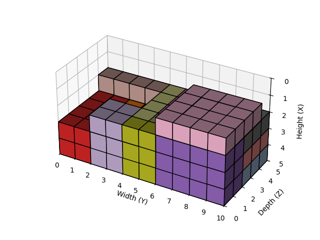
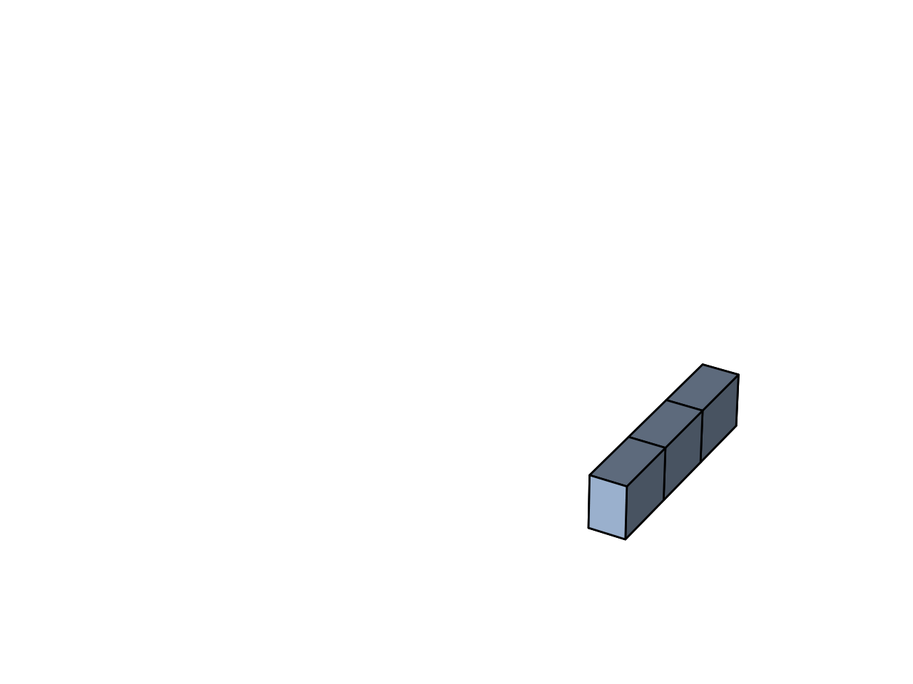

# PyConsolidation

PyConsolidation is a Python-based toolkit for solving 3D bin packing and container loading problems using various search algorithms. This project implements multiple approaches to efficiently arrange 3D blocks into a confined space, maximizing space utilization while maintaining physical stability constraints.

## Algorithms
<div style="display: flex; justify-content: space-around; align-items: center;">
    <div>
        
    </div>
    <div>
        
    </div>
</div>

The project implements three main algorithms:

### 1. Monte Carlo Beam Search [tetris_beam_search_mc.py](./tetris_beam_search_mc.py)
A stochastic variant of beam search that combines:
- Monte Carlo exploration of placement options
- Beam search for focused optimization
- Randomized trials to escape local optima
- Includes heuristic scoring based on:
  - Bottom fill score
  - Volume utilization
  - Height minimization
  - Hole avoidance

### 2. Beam Search [tetris_beam_search.py](./tetris_beam_search.py)
A 3D beam search algorithm leveraging NumPy for efficient array operations:
- Uses beam search to explore promising block arrangements
- Supports block rotation in 3D space


### 3. Tetris Dynamic Programming [tetris_dp.py](./tetris_dp.py)
A 2D dynamic programming approach that solves rectangular packing problems by prioritizing:
- Bottom filling to ensure stability
- Maximizing space utilization
- Avoiding floating blocks

## Key Features

- **3D Visualization**: Matplotlib-based visualization of the packed containers
- **Stability Constraints**: Ensures blocks are properly supported (grounded) to maintain physical feasibility
- **Rotation Support**: Optional rotation of blocks to maximize space utilization
- **Beam Width Control**: Adjustable search parameters to balance solution quality with computational efficiency
- **Multiple Retry Logic**: Automatic retry with wider beam width to avoid local minima

## Usage

Each algorithm can be run directly as a Python script with test cases included:

```python
# Example for tetris_beam_search_np.py
if __name__ == "__main__":
    # Define blocks as (height, width, depth) tuples
    test_case = [(1, 4, 4), (1, 3, 3), (1, 2, 2)]
    
    # Run with specific container dimensions
    run_test_case("Test Case Name", test_case, W=4, H=3, D=4)
```

## Performance Metrics

The solution quality is evaluated using multiple metrics:
- **Bottom Fill Score**: Prioritizes placing blocks near the bottom for stability
- **Volume Utilization**: Ratio of filled space to total container volume
- **Maximum Height**: Height of the tallest point in the packed container
- **Hole Count**: Number of empty spaces surrounded by blocks

## Applications

This toolkit can be applied to various real-world scenarios including:
- Container loading optimization
- Warehouse storage planning
- 3D printing job scheduling
- Shipping container utilization

## Dependencies

- NumPy: For efficient array operations
- Matplotlib: For 3D visualization
- Python 3.6+
